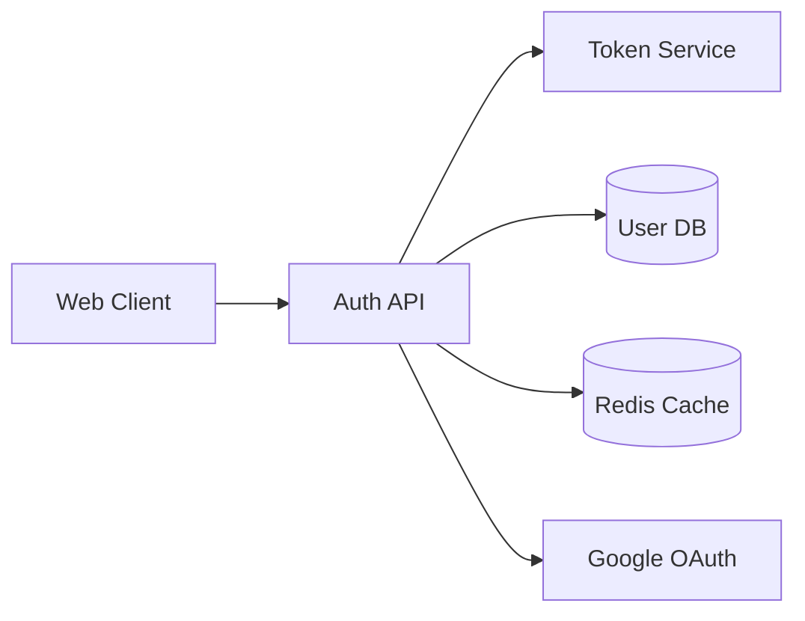

# 🤖 Copilot Agent Mode - Complete Setup Guide

## Overview

The **RakDev AI Extension** now leverages GitHub Copilot's **Agent Mode** (`@workspace`) to automatically generate design documents from requirements. This gives you:

✅ **Full automation** - No manual copy/paste  
✅ **Real-time visibility** - Watch Copilot work in the chat panel  
✅ **Interactive refinement** - Ask follow-ups and iterate  
✅ **Seamless workflow** - Requirement → Design with one command  

## How It Works

### The Magic: `@workspace` Agent Mode

When you run `RakDev AI: Generate Design from Requirement`:

1. **Extension creates** a placeholder design file
2. **Opens Copilot Chat** with an `@workspace` agent prompt
3. **Copilot reads** the full requirement document
4. **Generates** comprehensive design sections
5. **Automatically writes** to the design file
6. **You watch** the process in real-time!

### Key Innovation: Agent vs API

| Approach | Visibility | Control | File Updates |
|----------|-----------|---------|--------------|
| **Old: Silent API** | ❌ Hidden | ❌ Limited | Manual paste |
| **New: Agent Mode** | ✅ Real-time | ✅ Interactive | ✅ Automatic |

## Step-by-Step Usage

### 1. Prerequisites

Ensure you have:
- ✅ GitHub Copilot extension installed
- ✅ Signed into GitHub account
- ✅ Copilot subscription active
- ✅ RakDev AI Extension installed

### 2. Create a Requirement

```bash
# Command Palette: RakDev AI: New Requirement
# Or use: Cmd+Shift+P > New Requirement
```

Fill in the requirement with:
- **Title**: What feature/problem you're solving
- **Problem**: Clear problem statement
- **Scope**: What's in-scope and out-of-scope
- **Metrics**: Success criteria
- **Risks**: Known challenges

Example:
```yaml
---
id: REQ-2025-1043
title: User Authentication System
problem: Users need secure login with OAuth support
scope:
  in:
    - Email/password authentication
    - Google OAuth integration
    - JWT token management
  out:
    - Multi-factor authentication (future phase)
    - Biometric authentication
metrics:
  - Login latency < 500ms
  - 99.9% uptime for auth service
  - Support 10K concurrent users
risks:
  - Token theft via XSS attacks
  - OAuth provider downtime
status: approved
---
```

### 3. Generate Design with Agent Mode

```bash
# Command Palette: RakDev AI: Generate Design from Requirement
# Enter requirement ID: REQ-2025-1043
```

**What happens:**

#### Step 1: Placeholder Created
```markdown
---
id: DES-2025-5678
requirement: REQ-2025-1043
status: draft
decisions: []
---
# Design: User Authentication System

(Copilot is generating this design document...)
```

#### Step 2: Copilot Chat Opens
The chat panel shows:
```
@workspace I have a requirement document (REQ-2025-1043) and need you to 
generate a comprehensive technical design document with ID DES-2025-5678.

**Requirement Document Content:**
[Full requirement content shown here]

Please generate a complete design document and write it directly to the file:
/Users/you/project/docs/designs/DES-2025-5678.md

[Detailed instructions for Context, Decisions, Architecture, APIs, Risks, Tests, Rollout...]

**Important: Replace the entire placeholder content in the file with your generated design.**
```

#### Step 3: Watch Copilot Work
In the chat, you'll see real-time updates:
```
🤖 Reading requirement document...
🤖 Analyzing authentication scope and metrics...
🤖 Generating Context section...
🤖 Creating architectural decisions...
🤖 Defining API contracts...
🤖 Writing to file...
✅ Design document created successfully!
```

#### Step 4: File Auto-Updated
The design file is automatically filled with:

```markdown
---
id: DES-2025-5678
requirement: REQ-2025-1043
status: draft
decisions:
  - Use JWT for stateless authentication
  - Implement OAuth 2.0 for Google integration
  - Store refresh tokens in httpOnly cookies
  - Use Redis for token blacklisting
  - Implement rate limiting on auth endpoints
---
# Design: User Authentication System

## Context

This design addresses requirement REQ-2025-1043: "User Authentication System". 
The core problem is: Users need secure login with OAuth support.

The system must support email/password authentication and Google OAuth 
integration while maintaining sub-500ms login latency and 99.9% uptime 
for 10K concurrent users.

**Requirement Scope:**
- In: Email/password auth, Google OAuth, JWT token management
- Out: MFA (future), biometric auth

**Success Metrics:**
- Login latency < 500ms
- 99.9% uptime for auth service
- Support 10K concurrent users

## Decisions

### Decision 1: Use JWT for Stateless Authentication

**Rationale:** JWT tokens enable stateless authentication, reducing server 
load and improving scalability. Tokens can be validated without database 
lookups, supporting our 500ms latency requirement.

**Alternatives considered:**
- Session-based auth: Rejected due to server-side storage overhead and 
  scaling complexity
- OAuth-only: Rejected as not all users have Google accounts

### Decision 2: Implement OAuth 2.0 for Google Integration

**Rationale:** OAuth 2.0 is the industry standard for third-party 
authentication. Google's OAuth library is mature and well-documented.

**Alternatives considered:**
- SAML: Rejected as overly complex for consumer-facing app
- Custom OAuth: Rejected due to security risks

[... more decisions ...]

## Architecture Overview



**Components:**

1. **Auth API** (Express.js)
   - REST endpoints for login/logout/refresh
   - Rate limiting middleware
   - Input validation

2. **Token Service**
   - JWT generation and validation
   - Refresh token rotation
   - Token blacklisting

3. **User Database** (PostgreSQL)
   - User credentials (bcrypt hashed)
   - OAuth mappings
   - User profiles

4. **Redis Cache**
   - Token blacklist storage
   - Rate limit counters
   - Session metadata

**Data Flow:**
1. User submits credentials to Auth API
2. API validates against User DB
3. Token Service generates JWT + refresh token
4. Tokens returned to client (access in response, refresh in httpOnly cookie)
5. Client uses JWT for subsequent API calls
6. Token Service validates JWT without DB lookup

## API / Data Contracts

### POST /api/auth/login

**Request:**
```json
{
  "email": "user@example.com",
  "password": "securePassword123"
}
```

**Response (200 OK):**
```json
{
  "accessToken": "eyJhbGciOiJIUzI1NiIs...",
  "expiresIn": 3600,
  "user": {
    "id": "usr_123",
    "email": "user@example.com",
    "name": "John Doe"
  }
}
```

**Response Headers:**
```
Set-Cookie: refreshToken=abc123...; HttpOnly; Secure; SameSite=Strict; Max-Age=604800
```

[... more API endpoints ...]

## Risks

### Risk 1: Token theft via XSS attacks
**Impact:** High - Stolen tokens grant unauthorized access  
**Mitigation:**
- Store access tokens in memory only (not localStorage)
- Use httpOnly cookies for refresh tokens
- Implement Content Security Policy headers
- Regular security audits

### Risk 2: Google OAuth provider downtime
**Impact:** Medium - OAuth users cannot log in  
**Mitigation:**
- Provide fallback to email/password for OAuth users
- Implement circuit breaker pattern
- Display clear error messages with fallback options
- Monitor OAuth provider status

[... more risks ...]

## Test Strategy

**Unit Tests:**
- JWT generation/validation logic
- Password hashing/verification (bcrypt)
- Input validation functions
- Token refresh rotation logic

**Integration Tests:**
- Full login flow (email/password)
- Full OAuth flow (Google)
- Token refresh flow
- Logout and token invalidation
- Rate limiting enforcement

**Security Tests:**
- SQL injection attempts on login
- XSS payload in input fields
- Brute force password attempts
- Token expiration validation
- CSRF protection

**Performance Tests:**
- Load test: 10K concurrent login requests
- Measure P95 latency (target: < 500ms)
- Stress test: gradual load increase to find breaking point

**Acceptance Criteria (from requirement):**
- ✓ Login latency < 500ms
- ✓ 99.9% uptime (measured over 30 days)
- ✓ Support 10K concurrent users

## Rollout Plan

**Phase 1: MVP (Weeks 1-2)**
- Email/password authentication
- JWT token generation
- Basic login/logout endpoints
- User database setup
- Deploy to staging environment

**Phase 2: OAuth Integration (Weeks 3-4)**
- Google OAuth setup
- OAuth callback handling
- Account linking (email + OAuth)
- Deploy to production with 10% traffic

**Phase 3: Production Hardening (Week 5)**
- Rate limiting implementation
- Token refresh rotation
- Redis cache setup
- Security audit
- Full production rollout

**Phase 4: Monitoring & Optimization (Week 6)**
- Performance monitoring setup
- Alerting for auth failures
- Latency optimization if needed
- Documentation finalization

## Open Questions

1. **Password reset flow**: Should this be part of this design or separate?
2. **Session duration**: 1 hour for access token, 7 days for refresh token?
3. **Account lockout**: After how many failed login attempts?

```

### 4. Review and Iterate

The file is now fully populated! You can:

**Option A: Accept as-is**
- Review the design
- Save the file
- Move to task breakdown

**Option B: Refine in chat**
In the Copilot Chat (still open), ask:
```
Can you add more details about the password reset flow in Open Questions?
```

Copilot will update the file automatically!

**Option C: Manual edits**
- Make changes directly in the editor
- Save when done

## Benefits Summary

### 🚀 Speed
- **Before:** 30-60 minutes manual design writing
- **After:** 2-3 minutes automated generation

### 🔍 Transparency
- See exactly what prompt is sent
- Watch Copilot's reasoning process
- Understand design decisions

### ✨ Quality
- Comprehensive sections (Context, Decisions, Architecture, APIs, Risks, Tests)
- Industry best practices
- Consistent structure

### 🔄 Iteration
- Ask follow-ups in chat
- Copilot refines sections
- File updates automatically

### 📚 Learning
- Learn design patterns
- See architectural tradeoffs
- Understand security considerations

## Tips for Best Results

### Write Detailed Requirements
The better your requirement, the better the design:
- ✅ Clear problem statement
- ✅ Specific scope boundaries
- ✅ Measurable success metrics
- ✅ Known risks

### Use Follow-Up Questions
Don't settle for the first draft:
```
Can you add a sequence diagram for the OAuth flow?
Can you expand on error handling strategies?
Can you add retry logic to the Architecture section?
```

### Validate Against Your Stack
Copilot might suggest technologies you don't use:
- Review generated tech choices
- Ask for alternatives: "Can you use PostgreSQL instead of MongoDB?"
- Add project-specific constraints

### Leverage Chat History
The chat stays open - scroll back to see:
- Original prompt
- Copilot's reasoning
- Previous iterations

## Troubleshooting

### Chat Opens But Nothing Happens
- Check if Copilot is active (bottom right status bar)
- Try: `Cmd+Shift+I` to reopen chat
- Resend the prompt manually

### File Not Updated
- Verify file path in chat prompt
- Check file permissions
- Ask Copilot: "Please write to the file"

### Design Quality Issues
- Improve requirement detail
- Add more context in follow-up
- Manually edit the generated sections

### YAML Front-matter Format
If Copilot uses wrong format, ask:
```
Please fix the YAML front-matter to match this format:
---
id: DES-2025-5678
requirement: REQ-2025-1043
status: draft
decisions:
  - Decision 1
  - Decision 2
---
```

## What's Next?

After your design is generated and reviewed:

1. **Approve the design**
   ```yaml
   status: draft → review → approved
   ```

2. **Generate task breakdown**
   ```bash
   RakDev AI: Generate Task Breakdown
   ```

3. **Start implementation**
   - Tasks are linked to design sections
   - Track progress with task status

4. **Update requirement**
   ```yaml
   status: approved → implemented
   ```

## Advanced: Customizing the Agent Prompt

Want to add company-specific guidelines? Edit `src/extension.ts`:

```typescript
const chatPrompt = `@workspace I have a requirement document (${reqId})...

[Add your custom instructions here:]
- Use our company's tech stack: Node.js, PostgreSQL, Redis
- Follow our security guidelines: [link]
- Include cost estimates for cloud resources
- Add database migration scripts

...rest of prompt
`;
```

## Comparison: Manual vs Agent Mode

| Task | Manual | Agent Mode |
|------|--------|-----------|
| Time to generate | 30-60 min | 2-3 min |
| Consistency | ❌ Varies | ✅ Structured |
| Visibility | ❌ N/A | ✅ Real-time |
| Iteration | ⚠️ Rework | ✅ Chat follow-up |
| Learning | ⚠️ Self-guided | ✅ AI reasoning |
| Automation | ❌ Manual | ✅ Full auto |

---

**Ready to try it?** Start with a clear requirement and run:  
`RakDev AI: Generate Design from Requirement`

Watch the magic happen! 🚀
