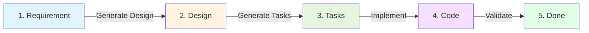

# 🔄 Complete Workflow: Requirement → Design → Tasks

## Overview

This guide shows the **complete end-to-end workflow** using RakDev AI Extension with Copilot Agent Mode.

**Time Investment:**
- ⏱️ Manual traditional approach: **4-6 hours**
- ⚡ With RakDev AI + Copilot: **10-15 minutes**

## The Flow



## Step 1: Create Requirement (2 min)

### Command
```bash
Cmd+Shift+P → RakDev AI: New Requirement
```

### What You Do
Fill in the requirement document:

```yaml
---
id: REQ-2025-1043
title: User Authentication System
problem: Users need secure way to authenticate with support for email/password and OAuth providers
scope:
  in:
    - Email/password authentication
    - Google OAuth integration
    - JWT token management
    - Refresh token rotation
    - Rate limiting on auth endpoints
  out:
    - Multi-factor authentication (future phase)
    - Biometric authentication
    - SAML integration
metrics:
  - Login latency < 500ms (P95)
  - 99.9% uptime for auth service
  - Support 10,000 concurrent users
  - Password reset within 5 minutes
risks:
  - Token theft via XSS attacks
  - OAuth provider downtime
  - Brute force password attacks
  - Session fixation vulnerabilities
status: approved
---

# Requirement: User Authentication System

## User Stories

### Story 1: Email/Password Login
**As a** user  
**I want to** log in with email and password  
**So that** I can access my account securely

**Acceptance Criteria:**
- User can register with email and password
- Password must be at least 8 characters
- Password is hashed with bcrypt before storage
- Login returns JWT access token
- Failed logins are rate-limited (5 attempts/15 min)

### Story 2: OAuth Login
**As a** user  
**I want to** log in with my Google account  
**So that** I don't have to create another password

**Acceptance Criteria:**
- User can initiate Google OAuth flow
- OAuth callback creates or links user account
- OAuth tokens are securely stored
- User can disconnect OAuth provider

## Security Considerations
- All passwords hashed with bcrypt (cost factor 12)
- JWT tokens signed with HS256
- Refresh tokens stored in httpOnly cookies
- CSRF protection on all mutations
- Rate limiting on auth endpoints
```

### Result
✅ `docs/requirements/REQ-2025-1043.md` created

---

## Step 2: Generate Design (3 min)

### Command
```bash
Cmd+Shift+P → RakDev AI: Generate Design from Requirement
Enter: REQ-2025-1043
```

### What Happens
1. Extension creates placeholder design file
2. Opens Copilot Chat with `@workspace` agent prompt
3. Shows full requirement content to Copilot
4. Copilot analyzes and generates comprehensive design
5. File is automatically written

### Watch Copilot Work
```
🤖 @workspace Reading requirement REQ-2025-1043...
🤖 Analyzing authentication requirements...
🤖 Determining architectural decisions...
🤖 Defining API contracts...
🤖 Identifying risks and mitigations...
🤖 Writing design document...
✅ Design DES-2025-5678 created!
```

### Result
✅ `docs/designs/DES-2025-5678.md` auto-generated with:
- Context (linked to requirement)
- 5 architectural decisions (JWT, OAuth, cookies, Redis, rate limiting)
- Architecture diagram (Mermaid)
- API contracts (/login, /logout, /refresh, /oauth/google)
- Component definitions (Auth API, Token Service, User DB, Redis)
- Risk mitigation strategies
- Test strategy (unit, integration, security, performance)
- Rollout plan (3 phases)

### Optional: Refine
Ask Copilot follow-ups:
```
Can you add a sequence diagram for the OAuth flow?
Can you expand on the Redis caching strategy?
```

---

## Step 3: Generate Tasks (3 min)

### Command
```bash
Cmd+Shift+P → RakDev AI: Generate Tasks from Design (Interactive)
Enter: DES-2025-5678
```

### What Happens
1. Extension reads design document
2. Extension reads linked requirement document
3. Opens Copilot Chat with `@workspace` agent prompt
4. Shows full design + requirement to Copilot
5. Copilot breaks down into 8-15 actionable tasks
6. Each task file is automatically created

### Watch Copilot Work
```
🤖 @workspace Analyzing design DES-2025-5678...
🤖 Extracting decisions, components, APIs, tests...
🤖 Breaking down into actionable tasks...

🤖 Creating TASK-2025-5001-jwt-token-service.md
   └─ Links: REQ-2025-1043#scope, DES-2025-5678#decision-1
   └─ Estimated: 4 hours

🤖 Creating TASK-2025-5002-oauth-google-integration.md
   └─ Links: REQ-2025-1043#scope, DES-2025-5678#decision-2
   └─ Estimated: 6 hours

🤖 Creating TASK-2025-5003-httponly-cookie-storage.md
   └─ Links: REQ-2025-1043#security, DES-2025-5678#decision-3
   └─ Estimated: 3 hours

... (12 tasks total)

✅ Generated 12 tasks with requirement and design links!
```

### Result
✅ 12 task files created in `docs/tasks/`:

```
TASK-2025-5001-jwt-token-service.md (4h)
TASK-2025-5002-oauth-google-integration.md (6h)
TASK-2025-5003-httponly-cookie-storage.md (3h)
TASK-2025-5004-redis-token-blacklist.md (2h)
TASK-2025-5005-rate-limiting-middleware.md (3h)
TASK-2025-5006-auth-api-endpoints.md (5h)
TASK-2025-5007-user-database-schema.md (3h)
TASK-2025-5008-password-reset-flow.md (4h)
TASK-2025-5009-unit-test-suite.md (6h)
TASK-2025-5010-integration-tests.md (8h)
TASK-2025-5011-security-tests.md (4h)
TASK-2025-5012-production-deployment.md (6h)

Total: 54 hours estimated
```

### Optional: Refine
Ask Copilot:
```
Can you split the auth-api-endpoints task into login and logout?
Can you add a task for API documentation?
```

---

## Step 4: Implement Tasks (ongoing)

### Pick First Task
Open: `TASK-2025-5001-jwt-token-service.md`

```markdown
---
id: TASK-2025-5001
design: DES-2025-5678
requirement: REQ-2025-1043
status: todo
acceptance:
  - JWT generation creates valid tokens
  - Token validation rejects expired tokens
  - Unit tests achieve 90%+ coverage
designSection: "Decisions > Decision 1: Use JWT"
requirementLink: "#scope"
estimatedHours: 4
---
# Task: Implement JWT Token Service

## Requirement Coverage
Covers [REQ-2025-1043](../requirements/REQ-2025-1043.md#scope):
- ✅ **In-scope**: Email/password authentication
- ✅ **In-scope**: OAuth integration
- ✅ **Success Metric**: Login latency < 500ms

## Design Context
Implements **Decisions > Decision 1: Use JWT for Authentication**
from [DES-2025-5678](../designs/DES-2025-5678.md#decisions).

## Implementation Details
### Step 1: Setup JWT Library
- Install `jsonwebtoken` package
- Configure signing secret from env variable

### Step 2: Create Token Service
[... detailed steps ...]
```

### Update Status
```yaml
status: in-progress
```

### Get Help from Copilot
Open Copilot Chat:
```
@workspace I'm working on TASK-2025-5001. 
Can you help me implement the generateAccessToken function?
```

Copilot reads the task context and provides specific guidance!

### Complete Task
```yaml
status: done
```

### Repeat for Next Task
Pick `TASK-2025-5002` and repeat.

---

## Step 5: Track Progress

### Status Bar
```
RakDev AI (R:1 D:1 T:12 ⚠️0)
         Tasks: 3 done, 2 in-progress, 7 todo
```

### Tree View
```
📁 RakDev AI
  📁 Requirements (1)
    📄 REQ-2025-1043 (approved) ✅
  📁 Designs (1)
    📄 DES-2025-5678 (approved) ✅
  📁 Tasks (12)
    ✅ TASK-2025-5001 (done)
    ✅ TASK-2025-5002 (done)
    ✅ TASK-2025-5003 (done)
    🔄 TASK-2025-5004 (in-progress)
    🔄 TASK-2025-5005 (in-progress)
    ⏳ TASK-2025-5006 (todo)
    ⏳ TASK-2025-5007 (todo)
    ... (remaining tasks)
```

### Validate Workspace
```bash
Cmd+Shift+P → RakDev AI: Validate Workspace
```

Shows any issues:
- Missing required fields
- Broken links
- Status inconsistencies

---

## Complete Example Flow

### 10-Minute End-to-End Demo

```bash
# Minute 0-2: Create Requirement
Cmd+Shift+P → New Requirement
# Enter: User Authentication System
# Fill in: problem, scope, metrics, risks
# Save: REQ-2025-1043.md

# Minute 2-5: Generate Design
Cmd+Shift+P → Generate Design from Requirement
# Enter: REQ-2025-1043
# Watch Copilot generate comprehensive design
# Result: DES-2025-5678.md (auto-created)

# Minute 5-8: Generate Tasks
Cmd+Shift+P → Generate Tasks from Design
# Enter: DES-2025-5678
# Watch Copilot break down into 12 tasks
# Result: 12 task files (auto-created)

# Minute 8-10: Review
# Review tasks in tree view
# Click requirement links to verify coverage
# Click design links to see context
# Prioritize task order

# Ready to implement!
```

---

## Key Benefits

### 🚀 Speed
- **Before:** 4-6 hours of manual work
- **After:** 10-15 minutes automated

### 🔗 Traceability
Every task shows:
- What requirement it addresses (with link)
- What design section it implements (with link)
- Why it exists

### 👁️ Visibility
Watch Copilot work:
- See generation process
- Understand reasoning
- Learn patterns

### 🎯 Control
- Start any task in any order
- Retry failed tasks
- Skip if requirements change
- Add custom tasks

### 🤖 AI Assistance
Get help per task:
```
@workspace Help with TASK-2025-5001
```

Copilot knows the full context!

---

## Best Practices

### ✅ Write Detailed Requirements
Better input = Better output:
- Clear problem statement
- Specific scope boundaries
- Measurable success metrics
- Known risks and constraints

### ✅ Review Generated Content
Don't blindly accept:
- Verify design decisions make sense
- Check task granularity (2-8 hours)
- Validate requirement coverage

### ✅ Iterate with Copilot
Use follow-ups:
- "Add more detail to X"
- "Split task Y into sub-tasks"
- "Include Z in the design"

### ✅ Track Progress
Update status regularly:
```yaml
status: todo → in-progress → done
```

### ✅ Use Links
Click requirement/design links to:
- Understand context
- Verify coverage
- See decisions

---

## Troubleshooting

### Design Not Generated?
- Check requirement file exists
- Verify Copilot is active
- Check requirement ID is correct

### Tasks Not Created?
- Verify design file exists
- Check design has `requirement:` field
- Ensure Copilot agent mode is working

### Links Broken?
- Verify file paths are correct
- Check IDs match in front-matter
- Use relative paths (../requirements/...)

### Copilot Doesn't Help?
- Make sure you use `@workspace`
- Reference specific task ID
- Provide context about what you're stuck on

---

## What's Next?

After completing the workflow:

1. **Implement tasks** - Start with foundational tasks
2. **Use Copilot per task** - Get AI help for each step
3. **Track progress** - Update status as you go
4. **Validate** - Run workspace validation
5. **Update requirement** - Mark as `implemented` when done

---

**Ready to streamline your development?**  
Start with: `RakDev AI: New Requirement` 🚀

**Full documentation:**
- Design Generation: `docs/AGENT-MODE-SETUP.md`
- Task Generation: `docs/INTERACTIVE-TASK-GENERATION.md`
- Quick References: `docs/quick-reference-*.md`
