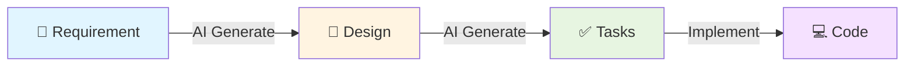

# 🎯 RakDev AI Extension - Complete Feature Set

## Overview

**RakDev AI Extension** streamlines development workflows by automating the **Requirement → Design → Task** pattern with GitHub Copilot Agent Mode.

**Time Savings:**
- ⏱️ Traditional manual approach: **4-6 hours**
- ⚡ With RakDev AI: **10-15 minutes**

## Features

### 1. Requirement Management
Create structured requirement documents with:
- Problem statements
- Scope (in/out)
- Success metrics
- Known risks
- Status tracking

**Command:** `RakDev AI: New Requirement`

### 2. AI-Powered Design Generation
Generate comprehensive technical designs from requirements with Copilot Agent Mode:
- ✅ Context analysis
- ✅ Architectural decisions with rationale
- ✅ Component definitions
- ✅ API contracts
- ✅ Risk mitigation strategies
- ✅ Test strategies
- ✅ Rollout plans
- ✅ **Real-time visibility** in Copilot Chat
- ✅ **Automatic file writing**

**Command:** `RakDev AI: Generate Design from Requirement`

### 3. Interactive Task Generation ⭐ NEW
Generate individual, actionable task files from designs with Copilot Agent Mode:
- ✅ **Requirement section links** - See what it covers
- ✅ **Design decision links** - Know what it implements
- ✅ **Acceptance criteria** - Clear definition of done
- ✅ **Effort estimates** - Time per task
- ✅ **Dependencies** - Task ordering
- ✅ **Individual control** - Start/retry/skip any task
- ✅ **Real-time visibility** in Copilot Chat
- ✅ **Automatic file writing**

**Command:** `RakDev AI: Generate Tasks from Design (Interactive)`

### 4. Validation & Tracking
- Live diagnostics for missing fields
- Cross-reference validation
- Status tracking (draft/review/approved/done)
- Progress visualization in status bar
- Tree view with document grouping

**Command:** `RakDev AI: Validate Workspace`

## Complete Workflow



### 10-Minute Demo

```bash
# Minute 0-2: Create Requirement
Cmd+Shift+P → RakDev AI: New Requirement
# Fill in: problem, scope, metrics, risks
# Save: REQ-2025-1043.md

# Minute 2-5: Generate Design with AI
Cmd+Shift+P → RakDev AI: Generate Design from Requirement
# Enter: REQ-2025-1043
# Watch Copilot generate comprehensive design in chat
# Result: DES-2025-5678.md (auto-written)

# Minute 5-8: Generate Tasks with AI
Cmd+Shift+P → RakDev AI: Generate Tasks from Design (Interactive)
# Enter: DES-2025-5678
# Watch Copilot break down into 8-15 tasks in chat
# Result: 12 task files (auto-written with links)

# Minute 8-10: Review
# Check requirement links in tasks
# Verify design section mappings
# Prioritize by dependencies

# Ready to implement with full traceability!
```

## Key Benefits

### 🚀 Speed
- **95% time reduction** in planning phase
- **2-3 minutes** per document generation
- **Instant** cross-reference linking

### 🔗 Traceability
Every task shows:
- **What requirement** it addresses (clickable link)
- **What design section** it implements (clickable link)
- **Why** it exists
- **How** to verify completion

### 👁️ Visibility
- **Watch Copilot work** in real-time
- **See AI reasoning** for decisions
- **Track progress** in tree view
- **Monitor status** in status bar

### 🎯 Control
- **Start tasks** in any order
- **Retry** failed tasks
- **Skip** if requirements change
- **Iterate** with Copilot chat
- **Add custom** tasks manually

### 🤖 AI Assistance
Get help for any task:
```
@workspace I'm working on TASK-2025-5001. 
How do I implement JWT validation?
```
Copilot knows the full context!

## Task File Example

```markdown
---
id: TASK-2025-5001
design: DES-2025-5678
requirement: REQ-2025-1043
status: todo
acceptance:
  - JWT generation creates valid tokens
  - Token validation rejects expired tokens
designSection: "Decisions > Decision 1: Use JWT"
requirementLink: "#scope"
estimatedHours: 4
---
# Task: Implement JWT Token Service

## Requirement Coverage
Covers [REQ-2025-1043](../requirements/REQ-2025-1043.md#scope):
- ✅ Email/password authentication (in-scope)
- ✅ OAuth integration (in-scope)  
- ✅ Login latency < 500ms (success metric)

## Design Context
Implements **Decisions > Decision 1: Use JWT**
from [DES-2025-5678](../designs/DES-2025-5678.md#decisions)

## Implementation Details
[Step-by-step instructions]

## Acceptance Criteria
[How to verify completion]

## Dependencies
None - foundational task

## Estimated Effort
4 hours
```

**Click links → Jump to requirement/design context!**

## Installation

```bash
# Build extension
npm install
npm run build

# Package
npm run package

# Install in VS Code
code --install-extension rakdev-ai-extension-0.0.2.vsix
```

## Requirements

- VS Code 1.90.0 or higher
- GitHub Copilot extension (for AI features)
- GitHub Copilot subscription

## Commands

| Command | Description |
|---------|-------------|
| `New Requirement` | Create requirement document |
| `New Design` | Create design document |
| `New Task` | Create task document |
| `Generate Design from Requirement` | AI-powered design generation |
| `Generate Tasks from Design (Interactive)` | AI-powered task breakdown |
| `Generate Requirements Catalog` | Create requirements catalog |
| `Generate Task Breakdown` | Quick task preview |
| `Validate Workspace` | Check for issues |
| `Show Flow Summary` | View workflow status |

## Documentation

- **[Complete Workflow](docs/COMPLETE-WORKFLOW.md)** - End-to-end guide
- **[Agent Mode Setup](docs/AGENT-MODE-SETUP.md)** - Design generation guide
- **[Interactive Task Generation](docs/INTERACTIVE-TASK-GENERATION.md)** - Task generation guide
- **[Quick Reference: Design](docs/quick-reference-copilot-design.md)** - Design quick start
- **[Quick Reference: Tasks](docs/quick-reference-tasks.md)** - Tasks quick start
- **[Task Generation Summary](TASK-GENERATION-SUMMARY.md)** - Feature overview

## Project Structure

```
reqflow-extension/
├── src/
│   ├── extension.ts       # Main extension logic
│   ├── indexer.ts         # Document indexing
│   └── tree.ts            # Tree view provider
├── docs/
│   ├── requirements/      # Requirement documents
│   ├── designs/           # Design documents
│   ├── tasks/             # Task documents
│   └── examples/          # Example files
├── templates/             # Document templates
├── snippets/              # VS Code snippets
└── resources/             # Extension resources
```

## Configuration

Available settings in VS Code settings:

```json
{
  "rakdevAi.idFormats.requirement": "^REQ-[0-9]{4}-[0-9]{4}$",
  "rakdevAi.idFormats.design": "^DES-[0-9]{4}-[0-9]{4}$",
  "rakdevAi.idFormats.task": "^TASK-[0-9]{4}-[0-9]{4}$",
  "rakdevAi.enforceApprovedDesignBeforeTask": true,
  "rakdevAi.breakdown.includeQualityTasks": true,
  "rakdevAi.breakdown.maxTasks": 40
}
```

## Status Tracking

### Status Bar
```
RakDev AI (R:1 D:1 T:12 ⚠️0)
```
Shows: Requirements / Designs / Tasks / Diagnostics

### Tree View
```
📁 RakDev AI
  📁 Requirements (1)
    📄 REQ-2025-1043 (approved) ✅
  📁 Designs (1)
    📄 DES-2025-5678 (approved) ✅
  📁 Tasks (12)
    ✅ TASK-2025-5001 (done)
    🔄 TASK-2025-5002 (in-progress)
    ⏳ TASK-2025-5003 (todo)
```

## Validation

Live diagnostics detect:
- ❌ Missing required fields
- ❌ Invalid status values
- ❌ Broken cross-references
- ❌ Unapproved design dependencies
- ⚠️ Draft requirements in approved designs

## Best Practices

### ✅ Write Detailed Requirements
- Clear problem statement
- Specific scope boundaries
- Measurable success metrics
- Known risks and constraints

### ✅ Review AI-Generated Content
- Verify technical decisions
- Check task granularity (2-8 hours)
- Validate requirement coverage
- Adjust estimates based on team velocity

### ✅ Iterate with Copilot
- Ask follow-up questions
- Request alternatives
- Add missing details
- Split/combine tasks

### ✅ Track Progress
- Update task status regularly
- Use tree view for overview
- Run validation periodically
- Keep links intact

## Troubleshooting

### Copilot Chat Doesn't Open
- Ensure GitHub Copilot is installed and active
- Check you're signed into GitHub
- Try: `Cmd+Shift+I` to open chat manually

### Files Not Auto-Written
- Verify `@workspace` appears in prompt
- Check file permissions
- Ask Copilot: "Please write to the file"

### Links Broken
- Verify file paths are correct
- Check IDs match in front-matter
- Use relative paths (../requirements/...)

### Quality Issues
- Add more detail to requirements
- Use follow-up questions in Copilot Chat
- Manually edit generated sections

## Contributing

Feedback and contributions welcome!

## License

[Your License]

## Version

**0.0.2** - Interactive Task Generation Release

### What's New in 0.0.2
- ✨ Interactive task generation with Copilot Agent Mode
- ✨ Automatic requirement section linking
- ✨ Automatic design decision mapping
- ✨ Real-time visibility in Copilot Chat
- ✨ Individual task control and status tracking
- ✨ Comprehensive documentation

---

**Get started:** `Cmd+Shift+P → RakDev AI: New Requirement` 🚀
