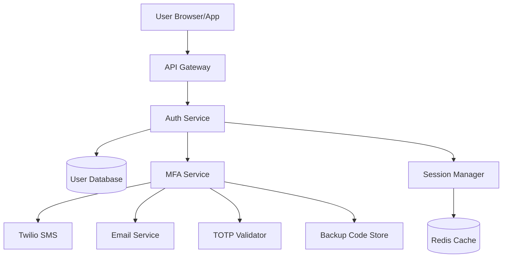

# AI-Powered Design Generation Example

This guide demonstrates how to use the **Generate Design from Requirement** command to automatically create comprehensive design documents using GitHub Copilot.

## Prerequisites

- ✅ GitHub Copilot extension installed and active
- ✅ At least one requirement document created in `docs/requirements/`

## Step-by-Step Workflow

### Step 1: Create a Requirement

First, create a requirement document:

**Command:** `RakDev AI: New Requirement`

**Example: docs/requirements/REQ-2025-1043-user-authentication.md**

```markdown
---
id: REQ-2025-1043
status: approved
title: Multi-factor Authentication System
problem: Users need enhanced security for accessing sensitive data. Current password-only authentication is vulnerable to breaches.
scope:
  in:
    - Email/password authentication
    - SMS-based 2FA
    - TOTP authenticator app support
    - Backup codes generation
    - Account recovery flow
  out:
    - Biometric authentication (future phase)
    - Hardware security keys (future phase)
    - Social login (out of scope)
metrics:
  - 99.9% authentication success rate
  - < 5 second average authentication time
  - 95% user adoption within 3 months
  - Zero security breaches related to authentication
risks:
  - SMS delivery failures may frustrate users
  - Users losing access to authenticator apps
  - Backup code mismanagement
  - Increased support tickets during rollout
---

# Requirement: Multi-factor Authentication System

## Background

Our current authentication system relies solely on email/password combinations. Recent security audits and customer feedback indicate this is insufficient for protecting sensitive user data.

## User Stories

1. As a user, I want to enable 2FA so that my account is more secure
2. As a user, I want multiple 2FA options so I can choose what works best for me
3. As a user, I want backup codes so I can recover my account if I lose my primary 2FA method
4. As a security admin, I want to enforce 2FA for all users with privileged access

## Constraints

- Must work with existing user database schema
- Cannot break current single-factor authentication during rollout
- Must comply with GDPR for storing phone numbers
- Must support both web and mobile apps
```

### Step 2: Generate Design with AI

**Command:** `RakDev AI: Generate Design from Requirement`

**Input:** `REQ-2025-1043`

**What happens:**
1. Extension reads the entire requirement document
2. Sends context to GitHub Copilot with structured prompt
3. Copilot analyzes the requirement and generates:
   - Architecture decisions
   - Component design
   - API specifications
   - Risk mitigations
   - Test strategy
   - Implementation phases

**Progress indicators:**
```
⏳ Generating design from REQ-2025-1043
  → Reading requirement...
  → Generating design with Copilot...
  → Copilot is thinking...
  → Writing design file...
  → Opening design...
✅ Design DES-2025-7832 generated from REQ-2025-1043 using Copilot!
```

### Step 3: Review Generated Design

**Example Output: docs/designs/DES-2025-7832.md**

```markdown
---
id: DES-2025-7832
requirement: REQ-2025-1043
status: draft
decisions:
  - Use JWT tokens with short expiration for session management
  - Implement TOTP (RFC 6238) for authenticator app support
  - Store backup codes as bcrypt hashes, not plain text
  - Use Twilio for SMS delivery with fallback to email
  - Implement progressive rollout with feature flags
---

# Design: Multi-factor Authentication System

## Context

This design addresses requirement REQ-2025-1043: "Multi-factor Authentication System". The core problem is: Users need enhanced security for accessing sensitive data. Current password-only authentication is vulnerable to breaches.

**Requirement Scope:**
- In: Email/password authentication, SMS-based 2FA, TOTP authenticator app support, Backup codes generation, Account recovery flow
- Out: Biometric authentication (future phase), Hardware security keys (future phase), Social login (out of scope)

**Success Metrics:**
- 99.9% authentication success rate
- < 5 second average authentication time
- 95% user adoption within 3 months
- Zero security breaches related to authentication

## Decisions

### Decision 1: Use JWT tokens with short expiration for session management
**Rationale:** JWTs allow stateless authentication, reducing server load and enabling horizontal scaling. Short expiration (15 minutes) with refresh tokens balances security and user experience.

**Alternatives considered:**
- Server-side sessions: Rejected due to scalability concerns and need for session storage
- Long-lived JWTs: Rejected due to security risks if tokens are compromised

### Decision 2: Implement TOTP (RFC 6238) for authenticator app support
**Rationale:** TOTP is industry standard, supported by all major authenticator apps (Google Authenticator, Authy, 1Password), and works offline.

**Alternatives considered:**
- HOTP (counter-based): Rejected due to synchronization issues
- Push notifications: Rejected as requires internet connection and external service

### Decision 3: Store backup codes as bcrypt hashes
**Rationale:** Prevents exposure of valid codes if database is compromised. Each code is single-use and immediately invalidated after use.

**Alternatives considered:**
- Encrypted storage: Rejected as key management adds complexity
- Plain text: Rejected for obvious security reasons

### Decision 4: Use Twilio for SMS delivery with fallback to email
**Rationale:** Twilio has 99.95% uptime and global coverage. Email fallback ensures users aren't locked out during SMS provider issues.

**Alternatives considered:**
- AWS SNS: Considered but Twilio has better international coverage
- Multiple SMS providers: Rejected due to cost and complexity

### Decision 5: Implement progressive rollout with feature flags
**Rationale:** Allows gradual enablement, A/B testing, and quick rollback if issues arise. Reduces risk identified in requirement.

**Alternatives considered:**
- Big bang deployment: Rejected as too risky
- Separate staging environment: Still needed, but doesn't replace feature flags

## Architecture Overview



**Components:**

1. **Auth Service**
   - Responsibility: Primary authentication logic, credential validation
   - Technology: Node.js/Express or equivalent
   - Interfaces: REST API, internal gRPC for microservices

2. **MFA Service**
   - Responsibility: 2FA enrollment, verification, backup code generation
   - Technology: Separate microservice to isolate security logic
   - Interfaces: REST API for client, message queue for async operations

3. **TOTP Validator**
   - Responsibility: Generate secrets, validate TOTP codes
   - Technology: Library (speakeasy or equivalent), RFC 6238 compliant
   - State: Stateless, time-based validation

4. **Session Manager**
   - Responsibility: JWT generation, validation, refresh token handling
   - Technology: Redis for revocation lists and refresh token storage
   - TTL: 15 min access tokens, 30 day refresh tokens

5. **SMS/Email Providers**
   - Responsibility: Deliver 2FA codes via multiple channels
   - Technology: Twilio API for SMS, existing email service
   - Failover: Automatic retry logic, fallback to email

**Data Flow:**

1. User logs in with email/password → Auth Service validates credentials
2. If MFA enabled → Generate 6-digit code, send via SMS/Email
3. User submits code → MFA Service validates (time-based for TOTP, one-time for SMS)
4. On success → Session Manager issues JWT access + refresh tokens
5. Client stores tokens, includes access token in subsequent requests
6. On token expiration → Client uses refresh token to get new access token

## API / Data Contracts

### Endpoints

**POST /api/auth/login**
```json
Request:
{
  "email": "user@example.com",
  "password": "hashed_password"
}

Response (MFA Required):
{
  "mfaRequired": true,
  "mfaToken": "temp_token_for_mfa",
  "methods": ["sms", "totp", "backup"]
}
```

**POST /api/auth/mfa/verify**
```json
Request:
{
  "mfaToken": "temp_token_from_login",
  "method": "sms",
  "code": "123456"
}

Response:
{
  "accessToken": "jwt_access_token",
  "refreshToken": "jwt_refresh_token",
  "expiresIn": 900
}
```

**POST /api/auth/mfa/enroll**
```json
Request:
{
  "method": "totp"
}

Response (TOTP):
{
  "secret": "BASE32_SECRET",
  "qrCode": "data:image/png;base64,...",
  "backupCodes": ["XXXX-XXXX", ...]
}
```

**POST /api/auth/mfa/disable**
```json
Request:
{
  "password": "confirm_password",
  "code": "current_mfa_code"
}

Response:
{
  "success": true
}
```

### Data Models

**User (extended)**
```typescript
interface User {
  id: string;
  email: string;
  passwordHash: string;
  mfaEnabled: boolean;
  mfaMethods: {
    sms?: { phoneNumber: string, verified: boolean };
    totp?: { secretHash: string, verified: boolean };
    backup?: { codesHash: string[], remaining: number };
  };
  mfaEnforced: boolean; // Admin-enforced for privileged users
  createdAt: Date;
  updatedAt: Date;
}
```

**MFA Session**
```typescript
interface MFASession {
  mfaToken: string; // Temporary token
  userId: string;
  availableMethods: string[];
  attempts: number;
  expiresAt: Date;
}
```

## Risks

### 1. SMS delivery failures may frustrate users
**Mitigation:**
- Implement email fallback automatically after 2 min timeout
- Show clear UI indicating "Didn't receive code? Try email instead"
- Monitor Twilio delivery rates, set up alerts for < 95% success rate
- Allow users to re-request codes with 60-second cooldown

### 2. Users losing access to authenticator apps
**Mitigation:**
- Generate 10 backup codes during enrollment, force user to download/print
- Implement account recovery flow requiring admin approval for high-value accounts
- Support multiple TOTP devices (user can enroll phone + tablet)
- Provide clear documentation on setting up new device

### 3. Backup code mismanagement
**Mitigation:**
- Hash codes before storage (bcrypt)
- Invalidate codes immediately after single use
- Show remaining backup codes count in user dashboard
- Allow regeneration of backup codes (invalidates old set)
- Notify via email when backup codes are used

### 4. Increased support tickets during rollout
**Mitigation:**
- Create comprehensive FAQ and video tutorials
- Implement in-app tooltips and guided setup flow
- Progressive rollout: start with power users, then general population
- 24/7 support coverage during first 2 weeks
- Feature flag to disable MFA enforcement if support overwhelmed

### 5. GDPR compliance for phone number storage
**Mitigation:**
- Encrypt phone numbers at rest (AES-256)
- Implement right-to-erasure (delete phone on MFA disable)
- Add clear consent checkbox during SMS enrollment
- Store data retention policy (delete after 90 days of inactivity)
- Regular GDPR compliance audits

## Test Strategy

### Unit Tests
- TOTP generation and validation logic
- Backup code hashing and verification
- JWT token creation, validation, expiration
- SMS/Email retry logic
- Rate limiting for code generation
- Password + MFA validation flows
**Coverage target:** > 90%

### Integration Tests
- End-to-end login flow with SMS 2FA
- End-to-end login flow with TOTP
- Backup code usage and invalidation
- Refresh token rotation
- MFA enrollment for all methods
- MFA disable flow
- Twilio API integration (mocked in CI, real in staging)
- Redis session storage

### Security Tests
- SQL injection attempts on login endpoints
- Brute force protection (rate limiting)
- JWT tampering detection
- Backup code hash collision resistance
- TOTP time-sync edge cases (clock skew tolerance)
- Session fixation attacks
- CSRF protection on MFA endpoints

### Performance Tests
- 1000 concurrent login requests with MFA
- Token validation latency < 10ms
- SMS delivery within 30 seconds (99th percentile)
- Redis cache hit rate > 95%
**Load target:** 10K active sessions

### Acceptance Tests
**Criteria from requirement:**
- ✅ User can enable 2FA via SMS with verification
- ✅ User can enable 2FA via TOTP app with QR scan
- ✅ User receives 10 backup codes and can download them
- ✅ User can log in using backup code
- ✅ Admin can enforce MFA for specific user roles
- ✅ Authentication success rate > 99.9% in production
- ✅ Average authentication time < 5 seconds

### User Acceptance Testing (UAT)
- Beta test with 100 internal users for 2 weeks
- Collect feedback on setup friction
- A/B test SMS vs TOTP adoption rates
- Monitor support tickets and common issues

## Rollout Plan

### Phase 1: Internal Testing (Week 1-2)
- Deploy to staging environment
- Internal team beta testing (50 users)
- Security audit and penetration testing
- Performance testing and optimization
- Documentation finalization

### Phase 2: Opt-in Beta (Week 3-4)
- Enable feature flag for 5% of users (opt-in)
- Monitor metrics: adoption rate, support tickets, success rate
- Iterate on UX based on feedback
- Twilio integration health checks

### Phase 3: Gradual Rollout (Week 5-8)
- Week 5: 25% of users (opt-in)
- Week 6: 50% of users (opt-in)
- Week 7: 100% of users (opt-in)
- Week 8: Enforce MFA for admin accounts (mandatory)

### Phase 4: Full Enforcement (Week 9-12)
- Week 9: Notify all users of upcoming enforcement
- Week 10: Enforce MFA for users with access to sensitive data
- Week 11: 90-day countdown for all remaining users
- Week 12: Full enforcement with grace period support channel

### Rollback Strategy
- Feature flags allow instant disable of MFA enforcement
- Database migrations are backward-compatible
- SMS/Email fallback prevents lockouts
- Admin override capability for emergency access

## Open Questions

1. **Recovery Flow for Lost Phone + Backup Codes:**
   - Should we require government ID upload for account recovery?
   - What's the acceptable delay for manual admin review?
   - Do we need an automated risk-based recovery system?

2. **Mobile App Implementation:**
   - Should mobile apps use biometric authentication as alternative to SMS/TOTP?
   - How do we handle device token management for push notifications?

3. **Rate Limiting:**
   - What's the acceptable number of failed MFA attempts before account lockout?
   - Should lockout duration increase exponentially?

4. **International SMS Costs:**
   - Twilio costs vary widely by country. Do we cap SMS 2FA to specific regions?
   - Should users in high-cost regions default to TOTP?

5. **Session Management:**
   - Should "Remember this device" option bypass MFA for 30 days?
   - How do we detect device fingerprint changes?

6. **Admin Controls:**
   - Should admins be able to remotely disable a user's MFA in emergency?
   - What audit trail is needed for such actions?
```

### Step 4: Refine and Approve

1. **Review Copilot's output** - Check technical accuracy and completeness
2. **Use Copilot Chat** to expand specific sections:
   - "Explain the session management architecture in more detail"
   - "Add error handling scenarios to the API contracts"
   - "Suggest additional security tests"
3. **Update status** in front-matter: `draft` → `review` → `approved`
4. **Generate tasks** using `RakDev AI: Generate Task Breakdown`

## Tips for Best Results

### Writing Better Requirements

The quality of AI-generated designs depends on requirement completeness:

✅ **Good requirement characteristics:**
- Clear problem statement
- Specific scope (in/out)
- Measurable metrics
- Identified risks
- User stories or use cases
- Technical constraints

❌ **Avoid vague requirements:**
- "Make the app faster" → Too generic
- "Add authentication" → Missing details about security level, methods, constraints

### Customizing Generated Designs

After Copilot generates the design:

1. **Add diagrams** - Copilot may suggest Mermaid syntax; verify it renders correctly
2. **Technology stack** - Update with your actual tech stack if Copilot assumed differently
3. **Company standards** - Align with your organization's architecture patterns
4. **Expand Open Questions** - Add questions specific to your team/domain

### When to Use Manual vs AI Generation

**Use AI generation when:**
- ✅ Requirement is well-documented
- ✅ Problem domain is common (auth, CRUD, API design)
- ✅ You want architectural suggestions and alternatives
- ✅ You need comprehensive boilerplate (test strategy, risks)

**Use manual creation when:**
- ❌ Highly specialized/proprietary system
- ❌ Requirement is incomplete or exploratory
- ❌ Design requires deep domain expertise
- ❌ Legacy system with many constraints not in requirement doc

## Fallback Mode Example

If Copilot is unavailable, the extension generates a structured template:

```markdown
---
id: DES-2025-7832
requirement: REQ-2025-1043
status: draft
decisions:
  - Implement in-scope features: Email/password authentication, SMS-based 2FA, TOTP authenticator app support, Backup codes generation, Account recovery flow
  - Explicitly exclude: Biometric authentication (future phase), Hardware security keys (future phase), Social login (out of scope)
---
# Design: Multi-factor Authentication System

## Context
This design addresses requirement REQ-2025-1043: "Multi-factor Authentication System". The core problem is: Users need enhanced security for accessing sensitive data. Current password-only authentication is vulnerable to breaches.

**Requirement Scope:**
- In: Email/password authentication, SMS-based 2FA, TOTP authenticator app support, Backup codes generation, Account recovery flow
- Out: Biometric authentication (future phase), Hardware security keys (future phase), Social login (out of scope)

**Success Metrics:**
- 99.9% authentication success rate
- < 5 second average authentication time
- 95% user adoption within 3 months
- Zero security breaches related to authentication

## Decisions
### Decision 1: Implement in-scope features: Email/password authentication, SMS-based 2FA, TOTP authenticator app support, Backup codes generation, Account recovery flow
**Rationale:** TBD
**Alternatives considered:** TBD

### Decision 2: Explicitly exclude: Biometric authentication (future phase), Hardware security keys (future phase), Social login (out of scope)
**Rationale:** TBD
**Alternatives considered:** TBD

## Architecture Overview
(Diagram placeholder - add Mermaid or link to external diagram)

**Components:**
- TBD

**Data Flow:**
- TBD

## API / Data Contracts
**Endpoints / Interfaces:**
- TBD

**Data Models:**
- TBD

## Risks
- SMS delivery failures may frustrate users
  - **Mitigation:** TBD
- Users losing access to authenticator apps
  - **Mitigation:** TBD
- Backup code mismanagement
  - **Mitigation:** TBD
- Increased support tickets during rollout
  - **Mitigation:** TBD

## Test Strategy
**Unit Tests:**
- TBD

**Integration Tests:**
- TBD

**Acceptance Tests:**
- TBD

## Rollout Plan
- Phase 1: TBD
- Phase 2: TBD

## Open Questions
- TBD
```

In this mode, you fill in TBD sections manually or use Copilot Chat for assistance.

---

**Next Steps:**
- [Generate Task Breakdown](../README.md#generate-advanced-breakdown)
- [Configure Extension Settings](../README.md#configuration-reference)
- [Learn about diagnostics and validation](../README.md#diagnostics-live)
