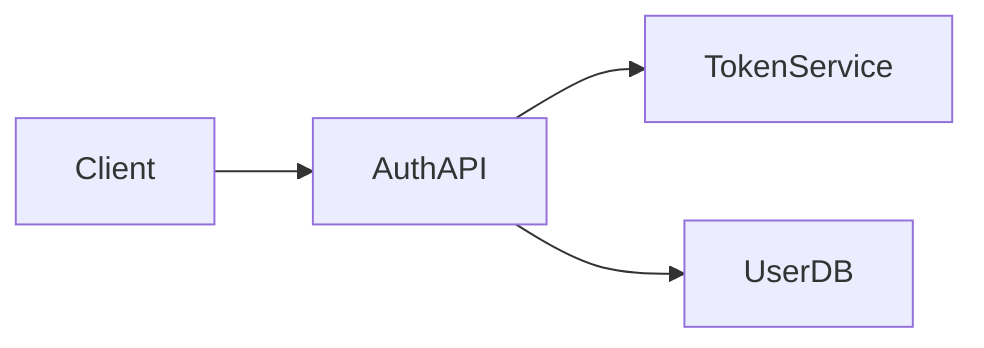

# Quick Reference: Copilot-Powered Design Generation

## Command: `RakDev AI: Generate Design from Requirement`

### What It Does
Opens GitHub Copilot Chat with a pre-filled prompt to generate a comprehensive technical design document from an existing requirement.

### Usage
1. **Cmd+Shift+P** → `RakDev AI: Generate Design from Requirement`
2. Enter requirement ID (e.g., `REQ-2025-1043`)
3. **Copilot Chat panel opens** with full prompt
4. **Review** Copilot's generated design
5. **Copy & paste** response into the design file
6. **Save** and validate

### What You See

#### 1. Placeholder File Created
```markdown
---
id: DES-2025-1234
requirement: REQ-2025-1043
status: draft
decisions: []
---
# Design: User Authentication Feature

(Copilot is generating this design document...)
```

#### 2. Copilot Chat Opens With Prompt
```
I have a requirement document (REQ-2025-1043) and need you to 
generate a comprehensive technical design document with ID DES-2025-1234.

**Requirement Document Content:**
```markdown
---
id: REQ-2025-1043
title: User Authentication Feature
problem: Users need secure login
scope:
  in:
    - Email/password authentication
    - OAuth integration (Google, GitHub)
...
```

Please generate a complete design document with:
1. Front-matter (YAML)
2. Context Section
...
```

#### 3. Copilot Generates Response
You see the design being written in real-time in the chat panel!

#### 4. Copy to File
- Select Copilot's response
- Paste into `DES-2025-1234.md`
- Replace the placeholder content
- Save!

### Key Benefits

✅ **Visible Process** - Watch Copilot work in real-time  
✅ **Full Control** - Edit the prompt or ask follow-ups  
✅ **Traceable** - See exactly what was requested  
✅ **Interactive** - Iterate on specific sections  
✅ **Educational** - Learn design patterns from AI  

### Example Generated Design Structure

```markdown
---
id: DES-2025-1234
requirement: REQ-2025-1043
status: draft
decisions:
  - Use JWT for stateless authentication
  - Implement OAuth 2.0 for third-party login
  - Store refresh tokens in httpOnly cookies
---
# Design: User Authentication Feature

## Context
This design addresses requirement REQ-2025-1043...

## Decisions

### Decision 1: JWT for Authentication
**Rationale:** Stateless tokens reduce server load...
**Alternatives considered:** Session-based auth rejected due to...

### Decision 2: OAuth 2.0 Integration
...

## Architecture Overview



**Components:**
- Auth API: Express.js REST endpoints
- Token Service: JWT generation/validation
- User DB: PostgreSQL with bcrypt hashing

## API / Data Contracts

### POST /api/auth/login
Request:
\`\`\`json
{
  "email": "user@example.com",
  "password": "securepass"
}
\`\`\`

Response:
\`\`\`json
{
  "accessToken": "eyJhbG...",
  "refreshToken": "8f3b2c...",
  "expiresIn": 3600
}
\`\`\`

## Risks
- **Risk:** Token theft via XSS attacks
  - **Mitigation:** Use httpOnly cookies, implement CSP headers

## Test Strategy
**Unit Tests:**
- Token generation/validation functions
- Password hashing/verification

**Integration Tests:**
- Full login/logout flow
- OAuth callback handling

## Rollout Plan
- Phase 1: Email/password auth (Week 1-2)
- Phase 2: OAuth integration (Week 3-4)
- Phase 3: Refresh token rotation (Week 5)
```

### Tips

🎯 **Review Before Pasting** - Copilot might hallucinate libraries or approaches not suitable for your stack  
📝 **Iterate in Chat** - Ask "Can you add more details to the API section?"  
⚙️ **Customize** - Edit the prompt template in `src/extension.ts` for your team's needs  
🔍 **Validate** - Extension shows diagnostics if required fields are missing after paste  

### Comparison: Old vs New Approach

| Aspect | Old (Silent API) | New (Chat Panel) |
|--------|-----------------|------------------|
| Visibility | ❌ Hidden process | ✅ Full transparency |
| Control | ❌ All or nothing | ✅ Edit & iterate |
| Learning | ❌ Just results | ✅ See reasoning |
| Debugging | ❌ Hard to trace | ✅ Clear audit trail |
| Flexibility | ❌ Fixed output | ✅ Ask follow-ups |

### Next Steps After Design Generation

1. ✅ Review generated design thoroughly
2. ✅ Update `status: draft` → `status: review` when ready
3. ✅ Use **Generate Task Breakdown** to create implementation tasks
4. ✅ Link tasks to design sections
5. ✅ Start coding with clear design reference

---

**Questions?** See full guide: [Copilot Chat Workflow](./copilot-chat-workflow.md)
